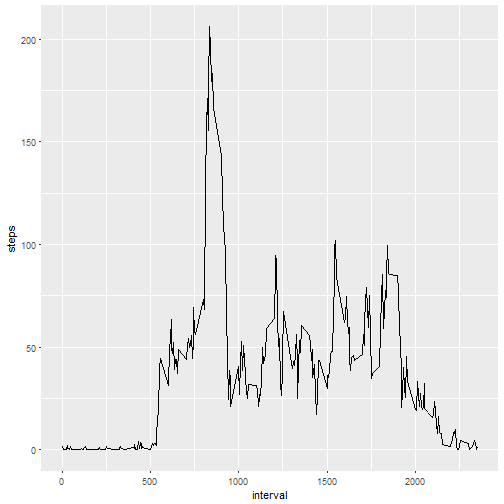
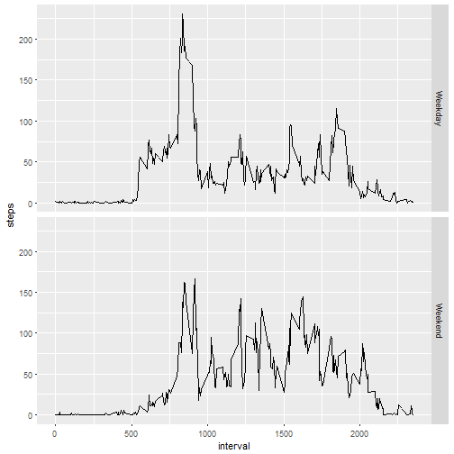

# Reproducible Research: Peer Assessment 1


## Loading and preprocessing

```r
activityData <- read.csv("activity.csv")
str(activityData)
```

```
## 'data.frame':	17568 obs. of  3 variables:
##  $ steps   : int  NA NA NA NA NA NA NA NA NA NA ...
##  $ date    : Factor w/ 61 levels "2012-10-01","2012-10-02",..: 1 1 1 1 1 1 1 1 1 1 ...
##  $ interval: int  0 5 10 15 20 25 30 35 40 45 ...
```

```r
summary(activityData)
```

```
##      steps                date          interval     
##  Min.   :  0.00   2012-10-01:  288   Min.   :   0.0  
##  1st Qu.:  0.00   2012-10-02:  288   1st Qu.: 588.8  
##  Median :  0.00   2012-10-03:  288   Median :1177.5  
##  Mean   : 37.38   2012-10-04:  288   Mean   :1177.5  
##  3rd Qu.: 12.00   2012-10-05:  288   3rd Qu.:1766.2  
##  Max.   :806.00   2012-10-06:  288   Max.   :2355.0  
##  NA's   :2304     (Other)   :15840
```

```r
head(activityData)
```

```
##   steps       date interval
## 1    NA 2012-10-01        0
## 2    NA 2012-10-01        5
## 3    NA 2012-10-01       10
## 4    NA 2012-10-01       15
## 5    NA 2012-10-01       20
## 6    NA 2012-10-01       25
```

```r
activitydataClean <- na.omit(activityData)
```

## Mean number of steps taken per day

```r
library(ggplot2)
library(dplyr)
activityperDay <- group_by(activitydataClean, date)
activityperDay <- summarize(activityperDay, steps=sum(steps))

summary (activityperDay)
```

```
##          date        steps      
##  2012-10-02: 1   Min.   :   41  
##  2012-10-03: 1   1st Qu.: 8841  
##  2012-10-04: 1   Median :10765  
##  2012-10-05: 1   Mean   :10766  
##  2012-10-06: 1   3rd Qu.:13294  
##  2012-10-07: 1   Max.   :21194  
##  (Other)   :47
```

```r
## Histogram of total step count for each day
qplot(steps, data=activityperDay)
```

```
## `stat_bin()` using `bins = 30`. Pick better value with `binwidth`.
```


## Mean and median of the total steps per day

```r
mean(activityperDay$steps)
```

```
## [1] 10766.19
```

```r
median(activityperDay$steps)
```

```
## [1] 10765
```

## Average daily activity pattern

```r
activityIntervals <- group_by(activitydataClean, interval)
activityIntervals <- summarize(activityIntervals, steps=mean(steps))

ggplot(activityIntervals, aes(interval, steps)) + geom_line()
```



## Interval that contains max number of steps

```r
activityIntervals[activityIntervals$steps==max(activityIntervals$steps),]
```

```
## # A tibble: 1 × 2
##   interval    steps
##      <int>    <dbl>
## 1      835 206.1698
```


## Impute missing values using the mean number of steps for each interval across all of the days

```r
nrow(activityData)-nrow(activitydataClean)
```

```
## [1] 2304
```

```r
names(activityIntervals)[2] <- "mean.steps"
activityImpute <- merge(activityData, activityIntervals)

activityImpute$steps[is.na(activityImpute$steps)] <- activityImpute$mean.steps[is.na(activityImpute$steps)]
```

## Histogram of the total number of steps per day using the imputed data

```r
activityperdayImputed <- group_by(activityImpute, date)
activityperdayImputed <- summarize(activityperdayImputed, steps=sum(steps))

qplot(steps, data=activityperdayImputed)
```

```
## `stat_bin()` using `bins = 30`. Pick better value with `binwidth`.
```


```r
mean(activityperdayImputed$steps)
```

```
## [1] 10766.19
```

```r
median(activityperdayImputed$steps)
```

```
## [1] 10766.19
```

## Check to see if there are differences in activity patterns between weekdays and weekends

```r
activityImpute$dayofweek <- weekdays(as.Date(activityImpute$date))
activityImpute$weekend <- as.factor(activityImpute$dayofweek=="Saturday" | activityImpute$dayofweek=="Sunday")
levels(activityImpute$weekend) <- c("Weekday", "Weekend")

activityWeekday <- activityImpute[activityImpute$weekend=="Weekday",]
activityWeekend <- activityImpute[activityImpute$weekend=="Weekend",]

activityintervalWeekday <- group_by(activityWeekday, interval)
activityintervalWeekday <- summarize(activityintervalWeekday, steps=mean(steps))
activityintervalWeekday$weekend <- "Weekday"
activityintervalWeekend <- group_by(activityWeekend, interval)
activityintervalWeekend <- summarize(activityintervalWeekend, steps=mean(steps))
activityintervalWeekend$weekend <- "Weekend"
```
## Panel plot containing plots of average number of steps taken on weekdays and weekends, respectively

```r
activityIntervals <- rbind(activityintervalWeekday, activityintervalWeekend)
activityIntervals$weekend <- as.factor(activityIntervals$weekend)
ggplot(activityIntervals, aes(interval, steps)) + geom_line() + facet_grid(weekend ~ .)
```


